# 💼 JobOps – Job Application Portal

A Full‑Stack Job Application Portal built as part of a Database Management System (DBMS) course. JobOps allows users to browse job listings, apply with a resume and profile photo, save jobs, track applications, and manage their account – all wrapped in a clean, responsive interface.

<p align="center">
  
</p>

---

## 📑 Table of Contents

- [✨ Features](#-features)
- [🖼️ Screenshots](#️-screenshots)
- [⚙️ Tech Stack](#️-tech-stack)
- [📁 Folder Structure](#-folder-structure)
- [🚀 Getting Started](#-getting-started)
  - [Prerequisites](#prerequisites)
  - [Backend Setup](#backend-setup)
  - [Frontend Setup](#frontend-setup)
- [🎬 Demo Video](#-demo-video)
- [🐛 Troubleshooting](#-troubleshooting)
- [📄 License](#-license)
- [📫 Contact](#-contact)

---

## ✨ Features

- **User Authentication** – Register, login, change password, delete account.
- **Job Browsing** – View all job postings with filters and search.
- **Application Management** – Apply to jobs, upload resume and profile photo.
- **Saved Jobs** – Bookmark jobs for later.
- **Profile Management** – Update personal details and uploaded documents.
- **Admin Panel** – (Optional) manage job listings and users.
- **Responsive UI** – Works on desktop and mobile devices.

---

## 🖼️ Screenshots

All screenshots are located in the [`Demo_Media/`](Demo_Media) folder.

<p align="center">
  <table>
    <tr>
      <td align="center">
        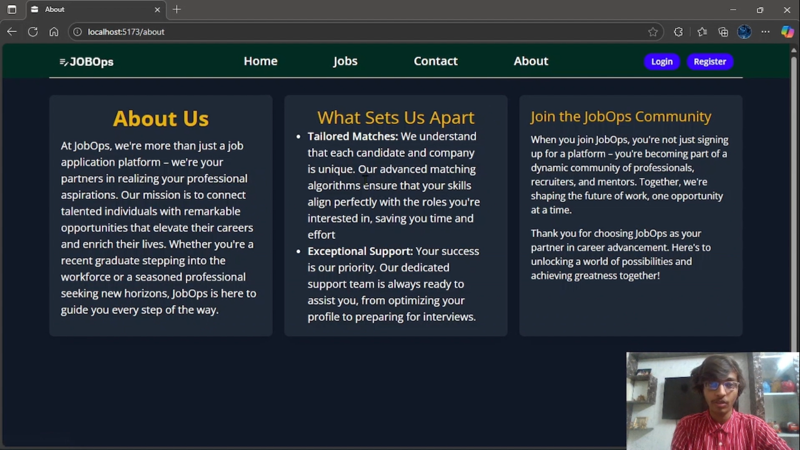<br/>
        <figure style="margin:0;">
          <figcaption><strong><sub>About Page</sub></strong></figcaption>
        </figure>
      </td>
      <td align="center">
        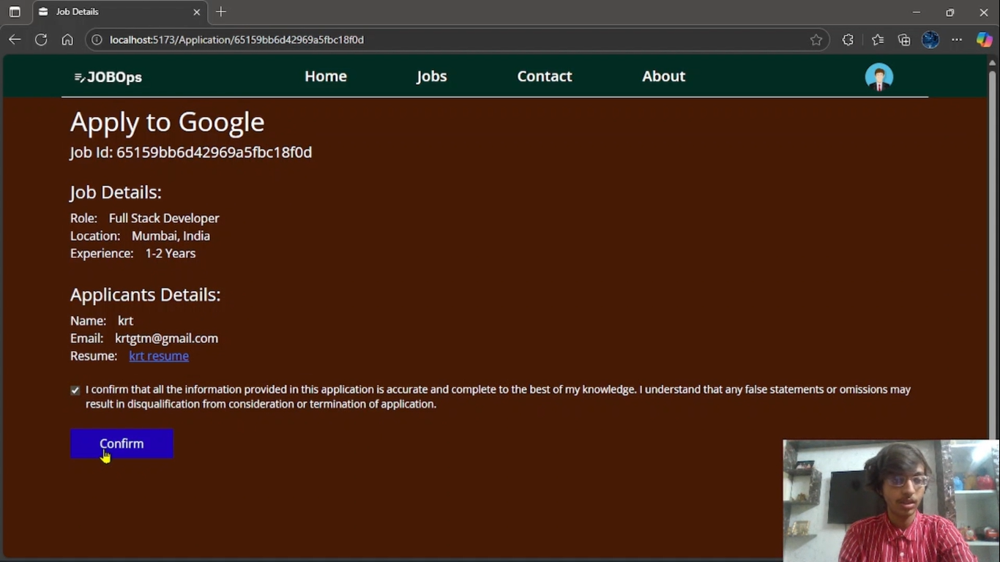<br/>
        <figure style="margin:0;">
          <figcaption><strong><sub>Application Page</sub></strong></figcaption>
        </figure>
      </td>
      <td align="center">
        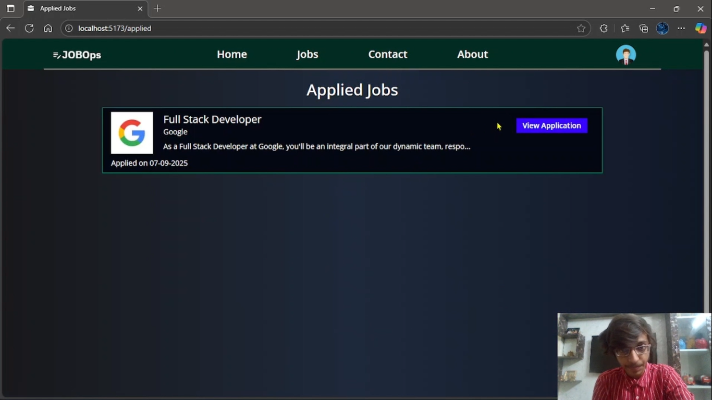<br/>
        <figure style="margin:0;">
          <figcaption><strong><sub>Applied Jobs</sub></strong></figcaption>
        </figure>
      </td>
    </tr>
    <tr>
      <td align="center">
        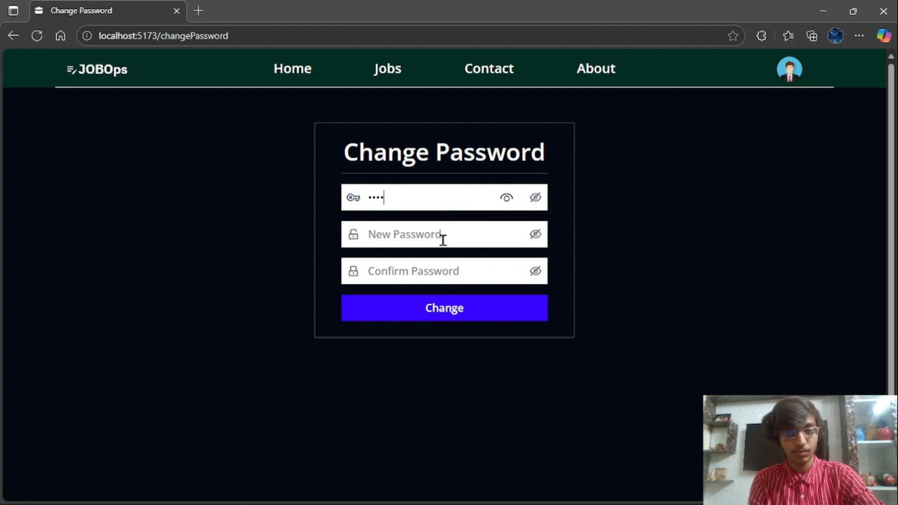<br/>
        <figure style="margin:0;">
          <figcaption><strong><sub>Change Password</sub></strong></figcaption>
        </figure>
      </td>
      <td align="center">
        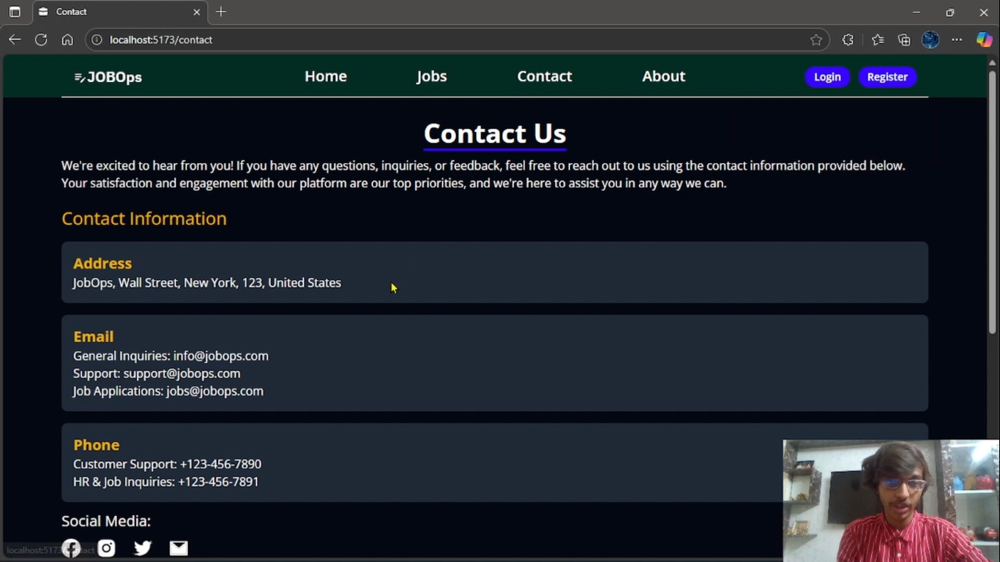<br/>
        <figure style="margin:0;">
          <figcaption><strong><sub>Contact Page Upper</sub></strong></figcaption>
        </figure>
      </td>
      <td align="center">
        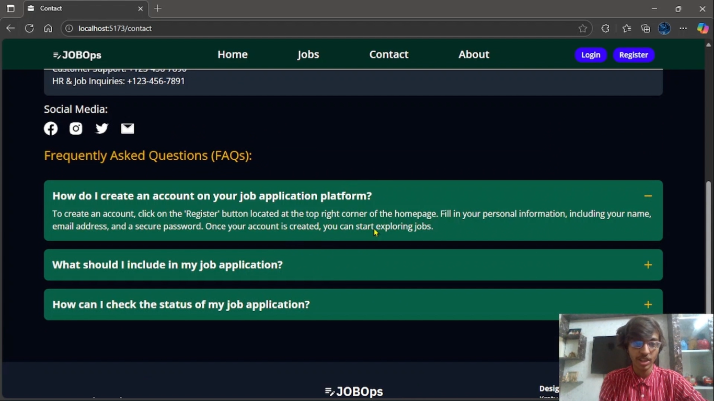<br/>
        <figure style="margin:0;">
          <figcaption><strong><sub>Contact Page Lower</sub></strong></figcaption>
        </figure>
      </td>
    </tr>
    <tr>
      <td align="center">
        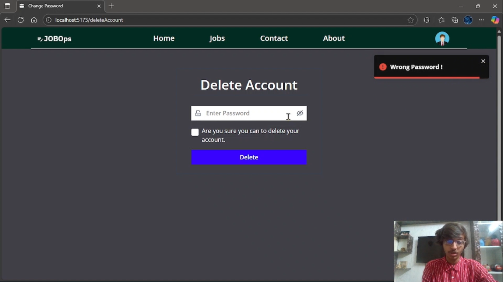<br/>
        <figure style="margin:0;">
          <figcaption><strong><sub>Delete Account</sub></strong></figcaption>
        </figure>
      </td>
      <td align="center">
        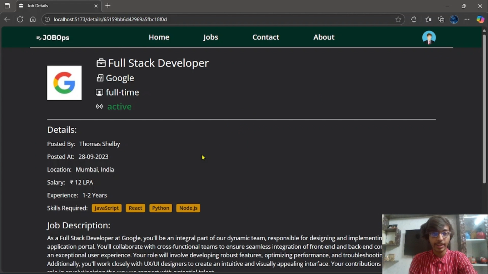<br/>
        <figure style="margin:0;">
          <figcaption><strong><sub>Job Description</sub></strong></figcaption>
        </figure>
      </td>
      <td align="center">
        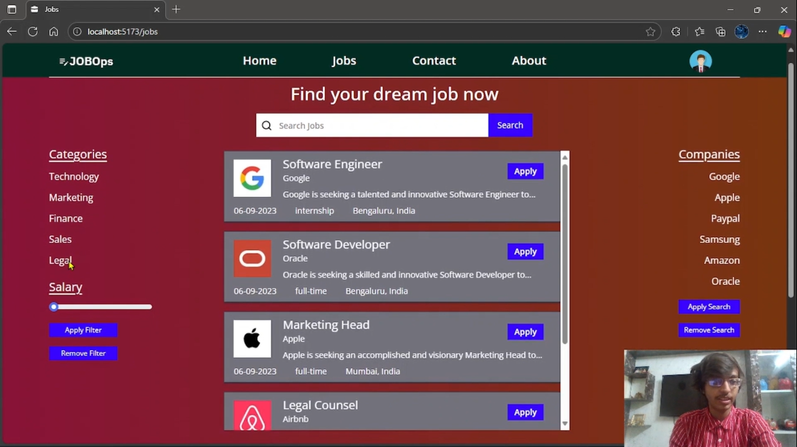<br/>
        <figure style="margin:0;">
          <figcaption><strong><sub>Job Filter Page</sub></strong></figcaption>
        </figure>
      </td>
    </tr>
    <tr>
      <td align="center">
        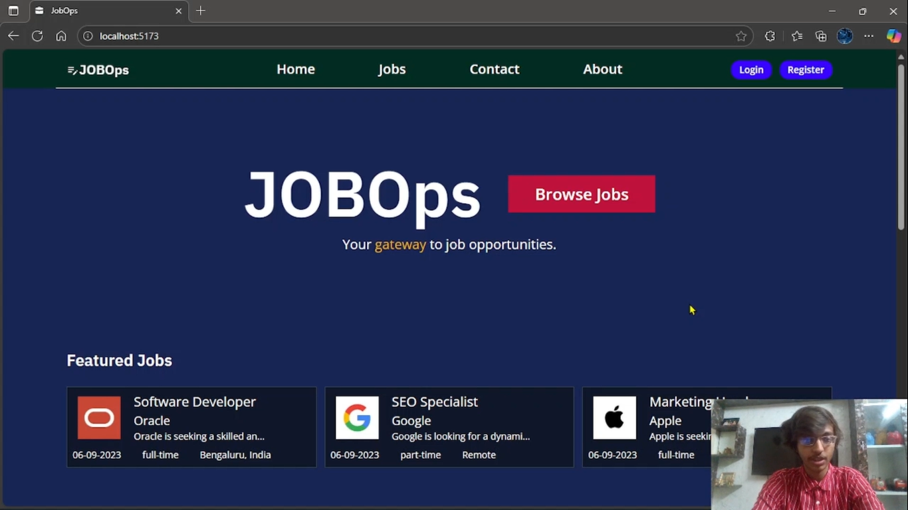<br/>
        <figure style="margin:0;">
          <figcaption><strong><sub>Main Page Upper</sub></strong></figcaption>
        </figure>
      </td>
      <td align="center">
        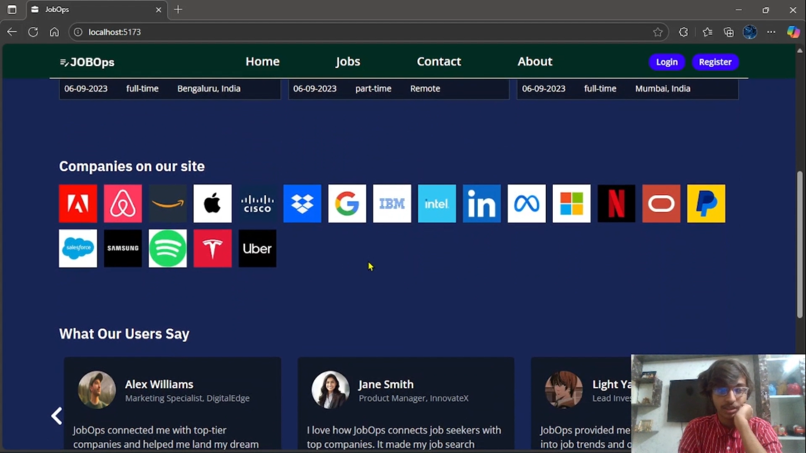<br/>
        <figure style="margin:0;">
          <figcaption><strong><sub>Main Page Lower</sub></strong></figcaption>
        </figure>
      </td>
      <td align="center">
        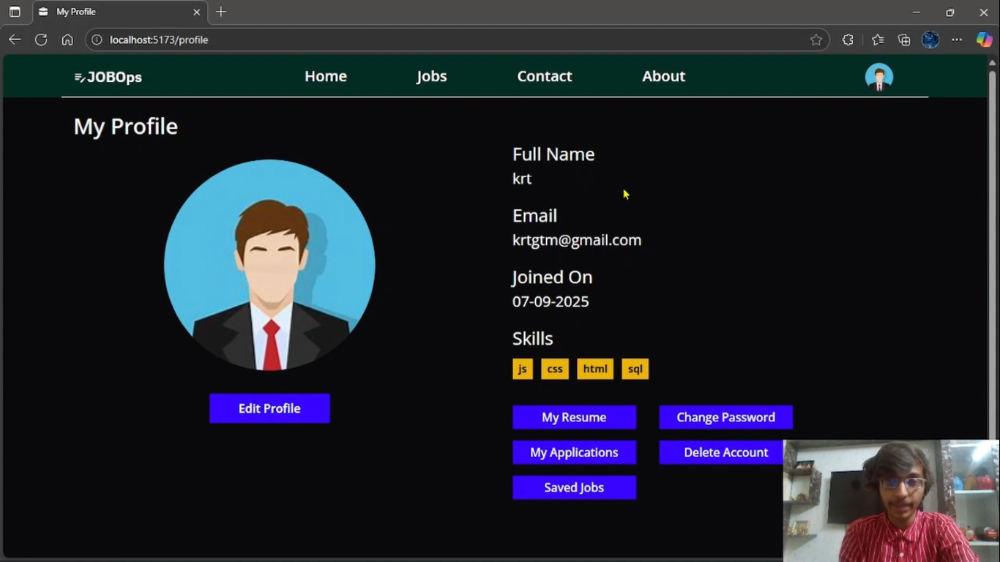<br/>
        <figure style="margin:0;">
          <figcaption><strong><sub>Profile Page</sub></strong></figcaption>
        </figure>
      </td>
    </tr>
    <tr>
      <td align="center">
        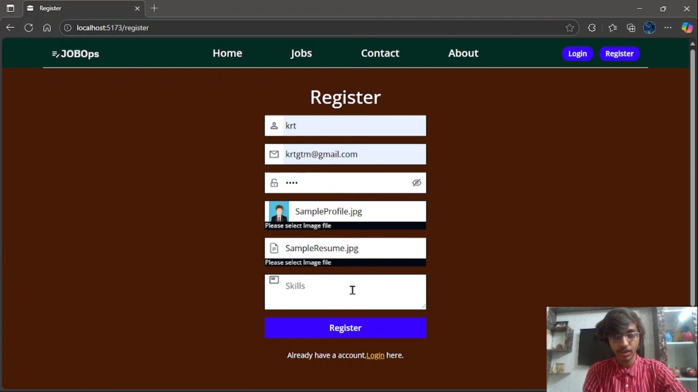<br/>
        <figure style="margin:0;">
          <figcaption><strong><sub>Registration Page</sub></strong></figcaption>
        </figure>
      </td>
      <td align="center">
        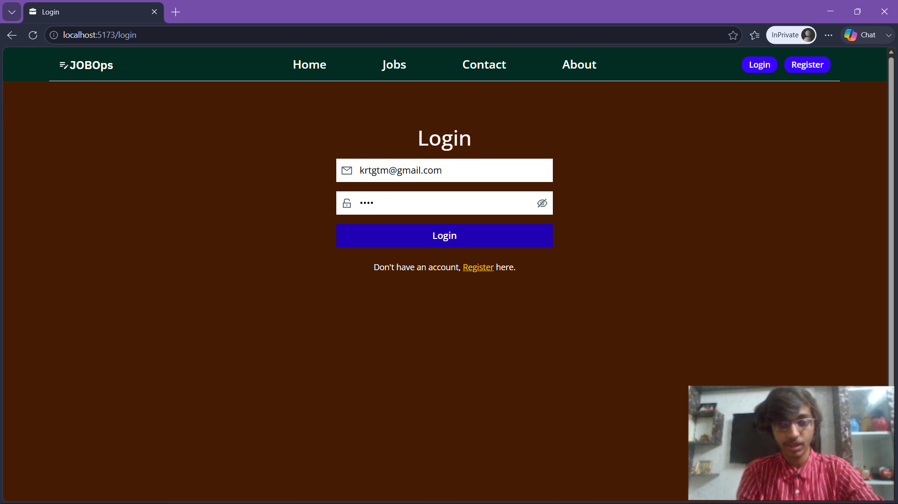<br/>
        <figure style="margin:0;">
          <figcaption><strong><sub>Login Page</sub></strong></figcaption>
        </figure>
      </td>
      <td align="center">
        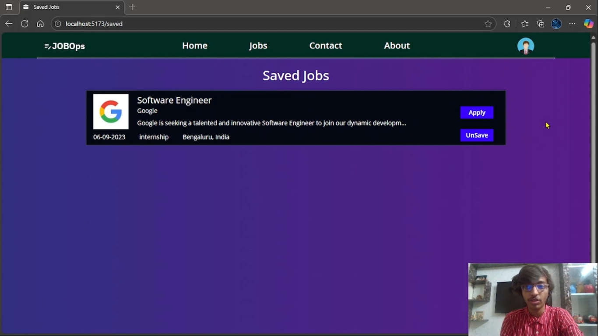<br/>
        <figure style="margin:0;">
          <figcaption><strong><sub>Saved Jobs</sub></strong></figcaption>
        </figure>
      </td>
    </tr>
  </table>
</p>


---

## ⚙️ Tech Stack

| **Layer** | **Technologies** |
|-----------|-------------------|
| **Frontend** | React.js, Vite, Tailwind CSS, Axios |
| **Backend** | Node.js, Express.js, Multer, JWT, bcrypt |
| **Database** | MongoDB, Cloudinary API |
| **File Storage** | Local File System and Cloudinary Image Store |
| **Build Tools** | NPM, Nodemon, NVM |

---

## 📁 Folder Structure

```
JobOps-Project/
|
├── Backend/                 
│   ├── config/
│   ├── controllers/
│   ├── models/
│   ├── routes/
│   ├── middleware/
│   ├── uploads/             
│   ├── server.js
│   ├── app.js
│   ├── .gitignore
│   ├── package-lock.json
│   └── package.json
|
├── Frontend/                
│   ├── public/
│   ├── src/
│   ├── .eslintrc.cjs
│   ├── .gitignore
│   ├── index.html
│   ├── package-lock.json
│   ├── package.json
│   ├── postcss.config.js
│   ├── README.md
│   ├── tailwind.config.js
│   ├── vercel.json
│   └── vite.config.js
|
├── Demo_Media/      
│   ├── AboutPage.png
│   ├── ApplicationPage.png        
│   ├── AppliedJobs.png
│   ├── ChangePassword.png
│   ├── ContactPage1.png
│   ├── ContactPage2.png
│   ├── DBMS_Project_Preview.mp4
│   ├── DeleteAccount.png
│   ├── JobDescription.png
│   ├── JobFilterPage.png
│   ├── LoginPage.png
│   ├── MainPage1.png
│   ├── MainPage2.png
│   ├── ProfilePage.png
│   ├── RegistrationPage.png
│   ├── SavedJobs.png
│   └── WebAppLogo.png
|
├── Test_Images/             
│   ├── SampleProfilePhoto.jpg
│   └── SampleResume.pdf
|
└── README.md (This File)
```

---

## 🚀 Getting Started

### Prerequisites

- **Node.js** (v22 or later, use "nvm" if needed) and **npm** installed.
- **MongoDB** installed and running locally (use "mongod" command in terminal).
- A code editor (VS Code recommended).

---

### Backend Setup

1. **Navigate to the Backend folder:**
   ```bash
   cd Backend
   ```

2. **Install dependencies:**
   ```bash
   npm install
   ```

3. **Create environment configuration:**
   - Copy `config/config.sample.env` → `config/config.env`.
   - Fill in your database credentials and JWT secret.

4. **Set up the database:**
   - Create a PostgreSQL database (e.g., `jobops`).
   - Run the SQL scripts (provided in `config/db.sql` if available) to create tables.

5. **Start the backend server:**
   ```bash
   node server.js
   ```
   The server will run on `http://localhost:5000` (or the port you set).

---

### Frontend Setup

1. **Navigate to the Frontend folder:**
   ```bash
   cd Frontend
   ```

2. **Install dependencies:**
   ```bash
   npm install
   ```

3. **Configure API base URL:**
   - Edit the `.env` file (or directly in `src/api.js`) to point to your backend URL.

4. **Run the development server:**
   ```bash
   npm run dev
   ```
   The frontend will be available at `http://localhost:5173`.

---

> **Note:** If you encounter dependency issues, try `npm audit fix` or `npm audit fix --force`.

---

## 🎬 Demo Video

Watch the full walkthrough on YouTube: 

[](https://youtu.be/wZ9ENq3zazA)

---

## 🐛 Troubleshooting

| Issue | Solution |
|-------|----------|
| **Port conflict** | Change the port in `config.env` (backend) or `vite.config.js` (frontend). |
| **Database connection fails** | Verify your PostgreSQL credentials and ensure the service is running. |
| **Uploads not working** | Check that the `uploads/` folder exists and has write permissions. |
| **Missing environment variables** | Ensure `config.env` is present and contains all required keys. |
| **npm install errors** | Use `npm install --legacy-peer-deps` if you face dependency conflicts. |

---

## 📄 License

This project is for educational purposes. Feel free to use and modify it for your own learning.

---

## 📫 Contact

For questions, suggestions, or collaborations, reach out via [GitHub](https://github.com/Kratugautam99) or leave a comment on the demo video.

---

<p align="center">
  <strong>♦️ Happy Job Hunting!</strong>
</p>
